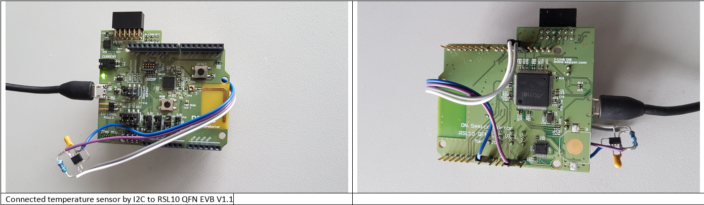
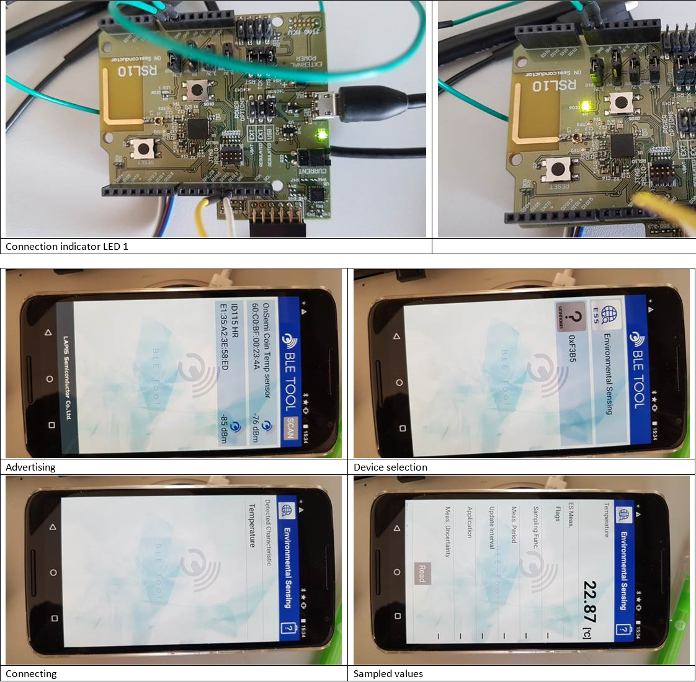

# NCT375_reak_envsens
Environmental BLE temperature sensor

Used components:
----------------
- SW RSL10 Evalution & Development Tools V1.4
- HW RSL10 QFN EVB V1.1
- Android mobile device with installed android APK from LAPIS named BLE Tool
- Temperature sensor NCT375 with I2C slave interface 



2018.02.12
There is nct375.h header file inside the NCT375_reak_envsens project. It contains two macro definition:

```C
/* Selection between power save ONE-SHOT-MODE (temperature register values are updated only in the user specified time)
 * and NORMAL-MODE during the BLE connection time (every 80ms temperature register value is updated automatically by the new value).
 * In the case normal mode selection ONE_SHOT_MODE definition has to be comment. Out of BLE connection, chip is in Shutdown Mode.
 * All circuitry except interface are powered down. */
#define ONE_SHOT_MODE

/* When the FULL_POWER_MODE definition is uncommented then the nct375 chip is in the normal mode out of BLE connection time too.
 * It is the chip maximal power consumption mode */
#define FULL_POWER_MODE
```

1)	Full Power Mode setting (maximal power consumption, normal power mode full time)
```C
#define ONE_SHOT_MODE
..
..
#define FULL_POWER_MODE
```
OR
```C
//#define ONE_SHOT_MODE
..
..
#define FULL_POWER_MODE
```
2)	Normal Power Mode setting ( only during BLE connection, out of connection there is shut down mode)
```C
//#define ONE_SHOT_MODE
..
..
//#define FULL_POWER_MODE
```
3)	One Shot-Mode ( all time is shutting down only after sampling start event given by user, chip is powered up for taking sample, then it is shutting down again)
```C
#define ONE_SHOT_MODE
..
..
//#define FULL_POWER_MODE
```

## Connection state between BLE device and RSL10 board, shown temperature.


